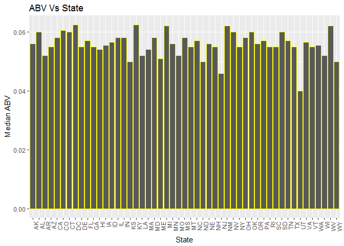
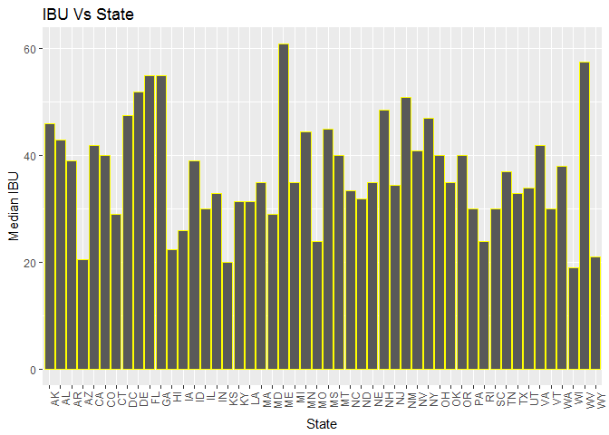
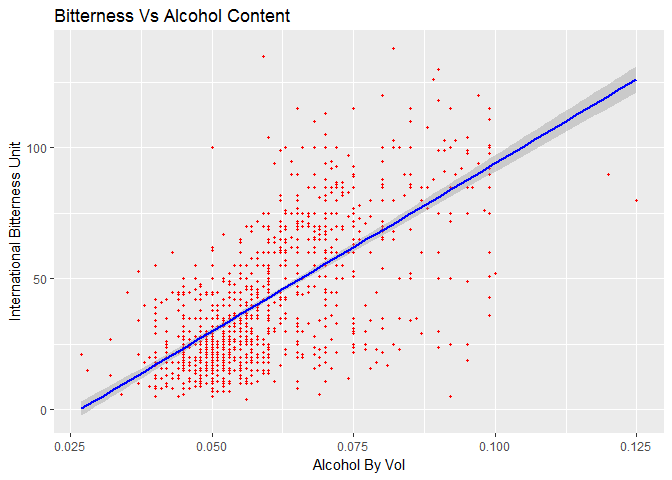

# BeerStudy
Nithya Devadoss  
July 1, 2017  
# Introduction:
### This case study is to analyze everything about Beers and Breweries across United States. We have the sample data collected on Beers and Breweries and is available in the Data directory inside the CaseStudy Repository in github.File count as following:

# Data Dictionary:
## Beers data file has 2410 observations and 7 columns: 

## Beers.csv: 
### Name: Name of the beer. 
### Beer ID: Unique identifier of the beer
### ABV: Alcohol by volume of the beer. 
### IBU: International Bitterness Units of the beer. 
### Brewery ID: Brewery id associated with the beer. 
### Style: Style of the beer. 
### Ounces: Ounces of beer.

## Breweries data file has 558 Observations and 4 columns

## Breweries.csv: 
### Brew ID: Unique identifier of the brewery. 
### Name: Name of the brewery. 
### City: City where the brewery is located. 
### State: State where the brewery is located.


# Objective:
### Based on this analysis we will discover various information which could be used for marketing decisions , like ; which state has most number of breweries ; which state has lowest ; Is there a relation between IBU and ABV; If so what is the strength ; Are there any outliers.

## In order to perform the study we will do the following steps which will also answer the questions :
### Load the required libraries to perform the study.We will need readr for file reading and ggplot2 for br plot and scatter plot


## Reading Files 
#### read.csv will read the csv file , header is set to true and all blanks will be read as NA
#### This will help for easy data cleanup
#### str function will display the field names and their datatype. It also displays the number of observations and the class of the variable

```r
Beers <- read.csv("C:/Nithya/MSDS/Term1/6306_Doing_DS/Week7/CaseStudy/Download/Beers.csv",header=T,na.strings="")
Breweries <- read.csv("C:/Nithya/MSDS/Term1/6306_Doing_DS/Week7/CaseStudy/Download/Breweries.csv",header=T,na.strings="")
str(Beers)
```

```
## 'data.frame':	2410 obs. of  7 variables:
##  $ Name      : Factor w/ 2305 levels "#001 Golden Amber Lager",..: 1638 577 1705 1842 1819 268 1160 758 1093 486 ...
##  $ Beer_ID   : int  1436 2265 2264 2263 2262 2261 2260 2259 2258 2131 ...
##  $ ABV       : num  0.05 0.066 0.071 0.09 0.075 0.077 0.045 0.065 0.055 0.086 ...
##  $ IBU       : int  NA NA NA NA NA NA NA NA NA NA ...
##  $ Brewery_id: int  409 178 178 178 178 178 178 178 178 178 ...
##  $ Style     : Factor w/ 99 levels "Abbey Single Ale",..: 18 17 15 11 15 79 17 21 17 11 ...
##  $ Ounces    : num  12 12 12 12 12 12 12 12 12 12 ...
```

```r
str(Breweries)
```

```
## 'data.frame':	558 obs. of  4 variables:
##  $ Brew_ID: int  1 2 3 4 5 6 7 8 9 10 ...
##  $ Name   : Factor w/ 551 levels "10 Barrel Brewing Company",..: 355 12 266 319 201 136 227 477 59 491 ...
##  $ City   : Factor w/ 384 levels "Abingdon","Abita Springs",..: 228 200 122 299 300 62 91 48 152 136 ...
##  $ State  : Factor w/ 51 levels " AK"," AL"," AR",..: 24 18 20 5 5 41 6 23 23 23 ...
```
## Beers data file has 2410 observations and 7 columns
## Breweries data file has 558 Observations and 4 columns

## Answers to the 7 Questions 

# 1. Count the number of breweries by state
#### Base package has aggregate function which can be used to count the rows based on a group by variable
#### group by here is on state and we will get the count of brew id . this can be any other variable in the dataframe

```r
aggregate(cbind(count = Breweries$Brew_ID) ~ Breweries$State, 
          data = Breweries, 
          FUN = function(x){NROW(x)})
```

```
##    Breweries$State count
## 1               AK     7
## 2               AL     3
## 3               AR     2
## 4               AZ    11
## 5               CA    39
## 6               CO    47
## 7               CT     8
## 8               DC     1
## 9               DE     2
## 10              FL    15
## 11              GA     7
## 12              HI     4
## 13              IA     5
## 14              ID     5
## 15              IL    18
## 16              IN    22
## 17              KS     3
## 18              KY     4
## 19              LA     5
## 20              MA    23
## 21              MD     7
## 22              ME     9
## 23              MI    32
## 24              MN    12
## 25              MO     9
## 26              MS     2
## 27              MT     9
## 28              NC    19
## 29              ND     1
## 30              NE     5
## 31              NH     3
## 32              NJ     3
## 33              NM     4
## 34              NV     2
## 35              NY    16
## 36              OH    15
## 37              OK     6
## 38              OR    29
## 39              PA    25
## 40              RI     5
## 41              SC     4
## 42              SD     1
## 43              TN     3
## 44              TX    28
## 45              UT     4
## 46              VA    16
## 47              VT    10
## 48              WA    23
## 49              WI    20
## 50              WV     1
## 51              WY     4
```

### There are 47 breweries in CO , followed by CA with 39 Breweries
### On the contrary , there is only one Brewery in DC,ND,SD,WV
 

# 2. Merging Beers and Breweries data
#### merge function is used to merge 2 dataframes Beer and Breweries with a joining column which is brewid. 
#### Since the common column name is different in both dataframes we can use by.x and by.y argument to define the joining column name
#### str function displays the class of the variable and the total number of observations
#### head function displays the first 6 observations by default
#### tail function displays the last 6 observations by default

```r
merge_df<-merge(Breweries,Beers,by.x = "Brew_ID" , by.y = "Brewery_id")
## Number of observations after data merging
str(merge_df)
```

```
## 'data.frame':	2410 obs. of  10 variables:
##  $ Brew_ID: int  1 1 1 1 1 1 2 2 2 2 ...
##  $ Name.x : Factor w/ 551 levels "10 Barrel Brewing Company",..: 355 355 355 355 355 355 12 12 12 12 ...
##  $ City   : Factor w/ 384 levels "Abingdon","Abita Springs",..: 228 228 228 228 228 228 200 200 200 200 ...
##  $ State  : Factor w/ 51 levels " AK"," AL"," AR",..: 24 24 24 24 24 24 18 18 18 18 ...
##  $ Name.y : Factor w/ 2305 levels "#001 Golden Amber Lager",..: 1640 1926 1525 802 1258 2185 71 458 1218 43 ...
##  $ Beer_ID: int  2689 2688 2687 2692 2691 2690 2683 2686 2685 2684 ...
##  $ ABV    : num  0.06 0.06 0.056 0.045 0.049 0.048 0.042 0.08 0.125 0.077 ...
##  $ IBU    : int  38 25 47 50 26 19 42 68 80 25 ...
##  $ Style  : Factor w/ 99 levels "Abbey Single Ale",..: 82 21 56 15 76 47 17 11 45 76 ...
##  $ Ounces : num  16 16 16 16 16 16 16 16 16 16 ...
```

```r
## **************
## First 6 records
## **************
head(merge_df)
```

```
##   Brew_ID             Name.x        City State        Name.y Beer_ID   ABV
## 1       1 NorthGate Brewing  Minneapolis    MN       Pumpion    2689 0.060
## 2       1 NorthGate Brewing  Minneapolis    MN    Stronghold    2688 0.060
## 3       1 NorthGate Brewing  Minneapolis    MN   Parapet ESB    2687 0.056
## 4       1 NorthGate Brewing  Minneapolis    MN  Get Together    2692 0.045
## 5       1 NorthGate Brewing  Minneapolis    MN Maggie's Leap    2691 0.049
## 6       1 NorthGate Brewing  Minneapolis    MN    Wall's End    2690 0.048
##   IBU                               Style Ounces
## 1  38                         Pumpkin Ale     16
## 2  25                     American Porter     16
## 3  47 Extra Special / Strong Bitter (ESB)     16
## 4  50                        American IPA     16
## 5  26                  Milk / Sweet Stout     16
## 6  19                   English Brown Ale     16
```

```r
## *************
## Last 6 records
## *************
tail(merge_df)
```

```
##      Brew_ID                        Name.x          City State
## 2405     556         Ukiah Brewing Company         Ukiah    CA
## 2406     557       Butternuts Beer and Ale Garrattsville    NY
## 2407     557       Butternuts Beer and Ale Garrattsville    NY
## 2408     557       Butternuts Beer and Ale Garrattsville    NY
## 2409     557       Butternuts Beer and Ale Garrattsville    NY
## 2410     558 Sleeping Lady Brewing Company     Anchorage    AK
##                         Name.y Beer_ID   ABV IBU                   Style
## 2405             Pilsner Ukiah      98 0.055  NA         German Pilsener
## 2406         Porkslap Pale Ale      49 0.043  NA American Pale Ale (APA)
## 2407           Snapperhead IPA      51 0.068  NA            American IPA
## 2408         Moo Thunder Stout      50 0.049  NA      Milk / Sweet Stout
## 2409  Heinnieweisse Weissebier      52 0.049  NA              Hefeweizen
## 2410 Urban Wilderness Pale Ale      30 0.049  NA        English Pale Ale
##      Ounces
## 2405     12
## 2406     12
## 2407     12
## 2408     12
## 2409     12
## 2410     12
```

### After merging we have 2410 obs. of  10 variables. This dataset is available in Data Directory along with the sample data. Filename : merge.csv

# 3. Reporting # of NA's
#### is.na function is used to find the observations which is NA which is the result of merge or the blanks which were converted to NA when we read the file
#### colsums will get the total count of the observations if is.na returns true

```r
colSums(is.na(merge_df))
```

```
## Brew_ID  Name.x    City   State  Name.y Beer_ID     ABV     IBU   Style 
##       0       0       0       0       0       0      62    1005       5 
##  Ounces 
##       0
```
### Based on the result ,we have 62 NA in the column ABV , 1005 NA in the column IBU and 5 NA in the column Style. 

# 4.Median alcohol content for each state
#### aggregate function is used to get the median value of ABV group by state.na.rm is set to TRUE to remove the NA observations and then get the median value
#### colnames sets the column names of the derived dataframe to a meaningful literal
#### Summary function will give the 5 point summary statistics of the variable given as argument

```r
ABV_ST<-aggregate(merge_df$ABV ~ merge_df$State, data = merge_df, median,na.rm=TRUE)
colnames(ABV_ST) <- c("State","ABV") 
ABV_ST
```

```
##    State    ABV
## 1     AK 0.0560
## 2     AL 0.0600
## 3     AR 0.0520
## 4     AZ 0.0550
## 5     CA 0.0580
## 6     CO 0.0605
## 7     CT 0.0600
## 8     DC 0.0625
## 9     DE 0.0550
## 10    FL 0.0570
## 11    GA 0.0550
## 12    HI 0.0540
## 13    IA 0.0555
## 14    ID 0.0565
## 15    IL 0.0580
## 16    IN 0.0580
## 17    KS 0.0500
## 18    KY 0.0625
## 19    LA 0.0520
## 20    MA 0.0540
## 21    MD 0.0580
## 22    ME 0.0510
## 23    MI 0.0620
## 24    MN 0.0560
## 25    MO 0.0520
## 26    MS 0.0580
## 27    MT 0.0550
## 28    NC 0.0570
## 29    ND 0.0500
## 30    NE 0.0560
## 31    NH 0.0550
## 32    NJ 0.0460
## 33    NM 0.0620
## 34    NV 0.0600
## 35    NY 0.0550
## 36    OH 0.0580
## 37    OK 0.0600
## 38    OR 0.0560
## 39    PA 0.0570
## 40    RI 0.0550
## 41    SC 0.0550
## 42    SD 0.0600
## 43    TN 0.0570
## 44    TX 0.0550
## 45    UT 0.0400
## 46    VA 0.0565
## 47    VT 0.0550
## 48    WA 0.0555
## 49    WI 0.0520
## 50    WV 0.0620
## 51    WY 0.0500
```

```r
summary(ABV_ST)
```

```
##      State         ABV         
##   AK    : 1   Min.   :0.04000  
##   AL    : 1   1st Qu.:0.05500  
##   AR    : 1   Median :0.05600  
##   AZ    : 1   Mean   :0.05585  
##   CA    : 1   3rd Qu.:0.05800  
##   CO    : 1   Max.   :0.06250  
##  (Other):45
```
## Bar Chart to show Median ABV in various states
#### ggplot function is used to get the bar chart where x axis is the state and y axis is Median ABV.ggtitle gives the heading/title to the bar chart
#### xlab and ylab is the xlabel and ylabel to the x&y axis repectively
#### geom_bar creates the bar plot and the lining is yellow.The xaxis texts were colliding and hence adjusted the text to flip to 90deg

```r
p <-ggplot(ABV_ST, aes(ABV_ST$State, ABV_ST$ABV))
p +geom_bar(stat = "identity",colour="YELLOW") + theme(axis.text.x=element_text(angle=90,hjust=1)) + xlab("State") + ylab("Median ABV") + ggtitle("ABV Vs State") 
```

<!-- -->

## Bar chart Inference: 
### There is little variation across all the states in median Alcohol  by volume. It is almost equal. This can be seen from the bar chart and also by the summary statistics. The minimum is 0.04 for the state of UT and maximum is 0.06 for the state of DC,KY,NV,MI,NM,OK,CT,CO,SD,WV  

## Median International bitteness Unit for each state
#### aggregate function is used to get the median value of IBU group by state.na.rm is set to TRUE to remove the NA observations and then get the median value
#### colnames function sets the column names of the derived dataframe to a meaningful literal
#### Summary function will give the 5 point summary statistics of the variable given as argument

```r
IBU_ST<-aggregate(merge_df$IBU ~ merge_df$State, data = merge_df, median,na.rm=TRUE)
colnames(IBU_ST) <- c("State","IBU")
IBU_ST
```

```
##    State  IBU
## 1     AK 46.0
## 2     AL 43.0
## 3     AR 39.0
## 4     AZ 20.5
## 5     CA 42.0
## 6     CO 40.0
## 7     CT 29.0
## 8     DC 47.5
## 9     DE 52.0
## 10    FL 55.0
## 11    GA 55.0
## 12    HI 22.5
## 13    IA 26.0
## 14    ID 39.0
## 15    IL 30.0
## 16    IN 33.0
## 17    KS 20.0
## 18    KY 31.5
## 19    LA 31.5
## 20    MA 35.0
## 21    MD 29.0
## 22    ME 61.0
## 23    MI 35.0
## 24    MN 44.5
## 25    MO 24.0
## 26    MS 45.0
## 27    MT 40.0
## 28    NC 33.5
## 29    ND 32.0
## 30    NE 35.0
## 31    NH 48.5
## 32    NJ 34.5
## 33    NM 51.0
## 34    NV 41.0
## 35    NY 47.0
## 36    OH 40.0
## 37    OK 35.0
## 38    OR 40.0
## 39    PA 30.0
## 40    RI 24.0
## 41    SC 30.0
## 42    TN 37.0
## 43    TX 33.0
## 44    UT 34.0
## 45    VA 42.0
## 46    VT 30.0
## 47    WA 38.0
## 48    WI 19.0
## 49    WV 57.5
## 50    WY 21.0
```

```r
summary(IBU_ST)
```

```
##      State         IBU       
##   AK    : 1   Min.   :19.00  
##   AL    : 1   1st Qu.:30.00  
##   AR    : 1   Median :35.00  
##   AZ    : 1   Mean   :36.98  
##   CA    : 1   3rd Qu.:42.75  
##   CO    : 1   Max.   :61.00  
##  (Other):44
```
## Bar Chart to show median IBU in various states
#### ggplot function is used to get the bar chart where x axis is the state and y axis is Median IBU.ggtitle gives the heading/title to the bar chart
#### xlab and ylab is the xlabel and ylabel to the x&y axis repectively
#### geom_bar creates the bar plot and the lining is yellow.The xaxis texts were colliding and hence adjusted the text to flip to 90deg

```r
q <-ggplot(IBU_ST, aes(IBU_ST$State, IBU_ST$IBU))
q +geom_bar(stat = "identity",colour="YELLOW") + theme(axis.text.x=element_text(angle=90,hjust=1)) + xlab("State") + ylab("Median IBU") + ggtitle("IBU Vs State") 
```

<!-- -->

## Bar chart Inference: 
### There is variation across the states in median IBU. This can be seen from the bar chart and also by the summary statistics. The minimum is 19 for the state of WI and maximum is 61 for the state of ME 

# 5. State having max alcoholic beer
#### which.max function gives the maximum value of the variable passed as argument.
#### str function find the column positions to get the column position
#### Based on the column position,print state and ABV from the vector or df

```r
alc<-merge_df[which.max(merge_df$ABV),]
alc[c(4,7)]
```

```
##     State   ABV
## 384    CO 0.128
```
### State of Colorado (CO) with ABV = 0.128

## State with Most bitter beer
#### which.max function gives the maximum value of the variable passed as argument.
#### prints the entire row for the max value of IBU
#### Based on the column position,print state and IBU from the vector/df

```r
bitter<-merge_df[which.max(merge_df$IBU),]
bitter[c(4,8)]
```

```
##      State IBU
## 1857    OR 138
```
### State of Oregon (OR) with IBU = 138

# 6. Summary Statistics for ABV
#### summary function gives the 5 point summary stats. We see that there are some NAs.
#### Since there are some NAs , use na.omit to remove the NAs and print the sumamry stats again

```r
summary(merge_df$ABV)
```

```
##    Min. 1st Qu.  Median    Mean 3rd Qu.    Max.    NA's 
## 0.00100 0.05000 0.05600 0.05977 0.06700 0.12800      62
```

```r
## After removing NAs
abv_n<-na.omit(merge_df$ABV)
summary(abv_n)
```

```
##    Min. 1st Qu.  Median    Mean 3rd Qu.    Max. 
## 0.00100 0.05000 0.05600 0.05977 0.06700 0.12800
```
### From the 5 point summary statistics, irrespective of the state , the minimum value is 0.00100 , Max val is 0.12800 ,Mean is 0.05977 , median is 0.05600 , Q1 is 0.05000 and Q3 is 0.06700

# 7. Relationship between Bitterness and Alcoholic content
#### na.omit removes the NA observations before plotting to avoid misleading results.
#### ggplot function is used to get the bar chart where x axis is the ABV and y axis is IBU.ggtitle gives the heading/title to the bar chart
#### xlab and ylab is the xlabel and ylabel to the x&y axis repectively
#### geom_point creates the scatter plot and the color chosen is Red. geom_smooth is used to draw a line along the observation points .
#### Since the method chosen is lm (linear method) it draws a 45deg linear line across the plot to show the linear regression. Color of the line is chosen to be BLUE

```r
merge_df1 <- na.omit(merge_df)
ggplot(merge_df1 ,aes(x=merge_df1$ABV, y=merge_df1$IBU)) + geom_point(shape=20, color="RED") +geom_smooth(method='lm',color="BLUE") + xlab("Alcohol By Vol") + ylab("International Bitterness Unit") +
  ggtitle("Bitterness Vs Alcohol Content") 
```

<!-- -->

## Scatter Plot Inference
### From the scatter plot we see that the relationship is mildly linear. There are few outliers with ABV=0.06 and IBU >110 ,  ABV=0.092 and IBU ~= 1.We can run a correlation test before and after removing the outliers to prove statistically.The data shows that most beers are with ABV around .05 has bitterness level (IBU) approximately around 50

# Conclusion:

### Here are the key takeaways from the above analysis based on the sample we have on Beers and Breweries - Maximum number of breweries is in CO (47) followed by CA(39).  There is only one brewery in DC,ND,SD,WV. There could be various factors which could affect this figure , for example State laws and tourism. State with most alcohol content is Colorado(CO) with ABV = 0.128 and the state with most bitter beer is Oregon (OR) with IBU = 138. The median alcohol content is around 0.05 which is approximately the same across various states. The minimum is in the state of UT. The bitterness level which is measured by IBU varies across various states and has a mildly linear correlation to the alcohol content. From the plots we also find that there are a few outliers which could affect this correlation statistically. Further research should be done with and without outliers and publish the study results. 
